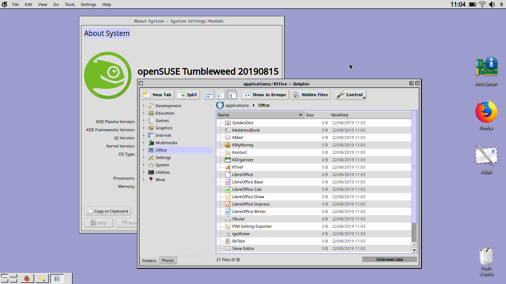
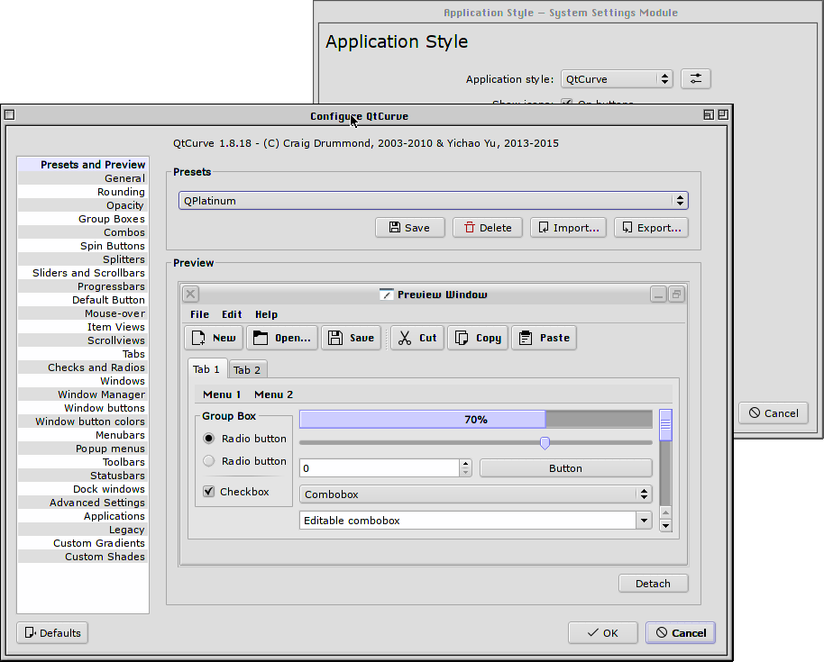
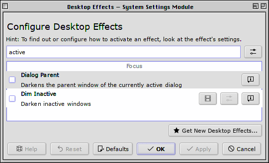
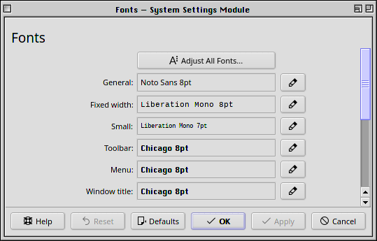

# kde-look-and-feel-platinum

Retro platinum-inspired look and feel package for KDE Plasma.

### Dependencies
This package automatically pulls in these dependencies upon installation:

* https://store.kde.org/p/1319936
* https://store.kde.org/p/1287747
* https://store.kde.org/p/998701

### Installation
1. `System Settings`> `Look and Feel`
2. `Get New Look and Feel Themes...`
3. Search "`Platinum`" and hit `Install`, or get it manually [here](https://store.kde.org/p/1320042/).
4. Check `Use desktop layout from theme` to get a _classic_ panel layout, but beware: this removes your current configuration!

---

If you want to go fully _classic_, here's some extra tips:

1. Install the `qtcurve` widget style on your system and import the [QPlatinum preset](https://store.kde.org/p/1287743/):

2. Disable inactive window dimming:

3. Under `System Settings`> `Application Style`> `Window Decorations`, go to the `Titlebar Buttons` tab and reorder the titlebar buttons like this:

4. Gather the used fonts and setup your fonts like this:

5. Install this [absolutely awesome Plymouth theme](https://store.kde.org/p/1284643/)!
